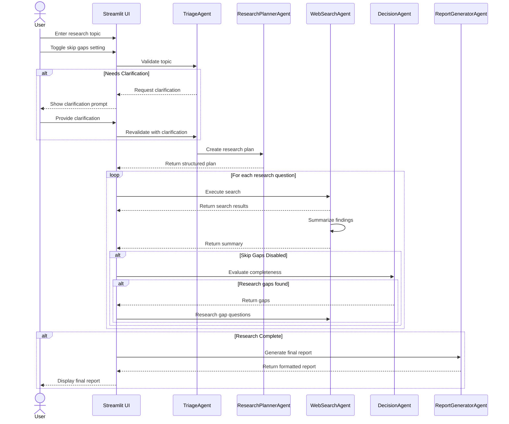

```mermaid
sequenceDiagram
    actor User
    participant UI as Streamlit UI
    participant Triage as TriageAgent
    participant Planner as ResearchPlannerAgent
    participant Search as WebSearchAgent
    participant Decision as DecisionAgent
    participant Report as ReportGeneratorAgent

    User->>UI: Enter research topic
    User->>UI: Toggle skip gaps setting
    UI->>Triage: Validate topic
    
    alt Needs Clarification
        Triage-->>UI: Request clarification
        UI-->>User: Show clarification prompt
        User->>UI: Provide clarification
        UI->>Triage: Revalidate with clarification
    end

    Triage->>Planner: Create research plan
    Planner-->>UI: Return structured plan
    
    loop For each research question
        UI->>Search: Execute search
        Search-->>UI: Return search results
        Search->>Search: Summarize findings
        Search-->>UI: Return summary
        
        alt Skip Gaps Disabled
            UI->>Decision: Evaluate completeness
            
            alt Research gaps found
                Decision-->>UI: Return gaps
                UI->>Search: Research gap questions
            end
        end
    end

    alt Research Complete
        UI->>Report: Generate final report
        Report-->>UI: Return formatted report
        UI-->>User: Display final report
    end
```
